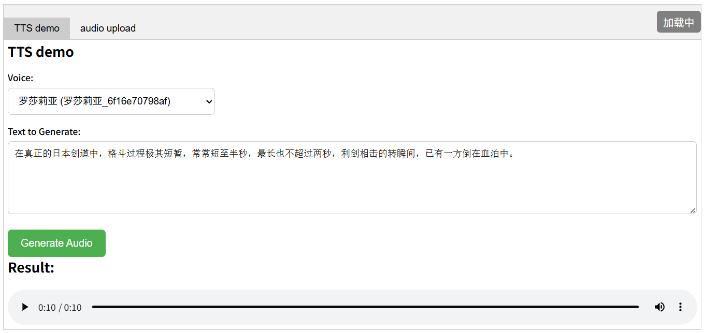

# VoxFlash-TTS ⚡

<p align="center">
  <strong>The Fastest Voice Cloning System for Real-Time Inference</strong><br>
  Zero-shot · Chinese & English · Edge-Deployable · Consumer GPU
</p>

<p align="center">
  <a href="https://voxflash.github.io/"></a>
  <a href="https://huggingface.co/VoxFlashTTS/VoxFlashTTS"></a>
  <a href="https://github.com/VoxFlash/VoxFlashTTS/stargazers"></a>
  <a href="LICENSE"></a>
  <a href="https://developer.nvidia.com/cuda-toolkit"></a>
  
</p>

<p align="center">
  <a href="https://voxflash.github.io/">🌐 Live Demo</a> ·
  <a href="#quick-start">🚀 Quick Start</a> ·
  <a href="#architecture">🏗 Architecture</a> ·
  <a href="#evaluation">📊 Evaluation</a> ·
  <a href="https://huggingface.co/VoxFlash/VoxFlash-TTS">🤗 Model Card</a>
</p>

---



---

## What is VoxFlash-TTS?

VoxFlash-TTS is the **fastest voice cloning system in the industry**, built around a radically compressed latent diffusion architecture. It supports zero-shot voice cloning in Chinese and English, runs on consumer-grade GPUs, and is designed from the ground up for edge deployment.

The key insight: most TTS inference bottlenecks are a **sequence length problem**. By compressing 24kHz audio into a 9 Hz latent representation — roughly 8× more compressed than EnCodec — VoxFlash reduces end-to-end compute by orders of magnitude without sacrificing acceptable audio quality.

> Generating 10 seconds of audio requires processing just **90 latent vectors**, compared to 750+ in conventional systems.

---

## Highlights

- ⚡ **Millisecond-level inference** on consumer GPUs
- 🎙️ **Zero-shot voice cloning** — no fine-tuning required
- 🌏 **Chinese & English** — same-language and cross-lingual cloning
- 💻 **Edge-friendly** — low VRAM footprint, low-end GPU compatible
- 🐳 **One-command Docker deployment** — up and running in minutes
- 📦 **~600 MB ONNX** — full pipeline in a single deployable artifact

---

## Architecture

VoxFlash-TTS is built on an ultra-compressed latent diffusion pipeline:

```
Text Input
    │
    ▼
┌─────────────────────┐
│   Phoneme Encoder   │  ConvNeXtV2 — lightweight, hardware-friendly
└─────────────────────┘
    │
    ▼
┌─────────────────────┐
│  Coarse Alignment   │  Explicit alignment — lower complexity than Cross-Attention
└─────────────────────┘
    │
    ▼
┌─────────────────────┐
│   Diffusion Model   │  Multi-step denoising in latent space (NFE=16)
└─────────────────────┘
    │                     ▲
    │              ┌──────┴──────┐
    │              │Speaker Enc. │  Reference audio → speaker embedding
    │              └─────────────┘
    ▼
┌─────────────────────┐
│    VAE Decoder      │  9 Hz latent → 24kHz high-fidelity waveform
└─────────────────────┘
    │
    ▼
Audio Output
```

### Why 9 Hz?

| System | Latent Frame Rate | Latent vectors for 10s audio |
|---|---|---|
| EnCodec | ~75 fps | ~750 |
| Speech LM (semantic tokens) | ~50 fps | ~500 |
| Stable Audio | ~21.5 fps | ~215 |
| **VoxFlash-TTS** | **9 fps** | **90** |

Transformer self-attention scales at O(n²) with sequence length. Cutting the sequence by 8× reduces attention compute by ~64×. This is why VoxFlash can deliver millisecond inference where others cannot.

---

## Quick Start

### Requirements

- NVIDIA GPU with CUDA ≥ 12.3.2
- Docker

### Installation

```bash
# Pull the image
docker pull berlinisaiah/ttsv2:v1
```

### Run

```bash
# Background mode (production)
docker container run -d --gpus all \
  --mount type=bind,source=$(pwd)/resources,target=/app/resources \
  -p 8000:8000 berlinisaiah/ttsv2:v1

# Foreground mode (debug)
docker container run -it --gpus all \
  --mount type=bind,source=$(pwd)/resources,target=/app/resources \
  -p 8000:8000 berlinisaiah/ttsv2:v1
```

### Access WebUI

Open your browser and navigate to:

```
http://127.0.0.1:8000/demo.html
```

---

## Capabilities

### Supported Languages

| Language | Same-language Cloning | Cross-lingual Cloning |
|---|---|---|
| Chinese (Mandarin) | ✅ | ✅ |
| English | ✅ | ✅ |

### Zero-Shot Cloning

No fine-tuning needed. Provide any reference audio clip and VoxFlash extracts a speaker embedding, injects it into the diffusion process, and outputs speech matching the target voice.

Cross-lingual cloning (e.g. Chinese reference → English output) is supported, demonstrating effective disentanglement of voice timbre from language identity.

---

## Evaluation

Audio samples are drawn from the [Seed-TTS](https://arxiv.org/abs/2406.02430) evaluation set for direct comparison with leading systems.

| System | Inference Speed | Deployment | Zero-Shot | Cross-lingual |
|---|---|---|---|---|
| Seed-TTS | Slow | Cloud GPU | ✅ | ✅ |
| CosyVoice 2 | Medium | Medium | ✅ | ✅ |
| FastSpeech variants | Fast | Low | ❌ | ❌ |
| **VoxFlash-TTS** | **Fastest** | **Edge / Consumer GPU** | **✅** | **✅** |

👉 Listen to audio samples at [voxflash.github.io](https://voxflash.github.io/)

---

## Use Cases

| Scenario | Key Requirement | VoxFlash Advantage |
|---|---|---|
| Real-time voice interaction | Low first-packet latency | Short latent sequences, fewer diffusion steps |
| Large-scale batch synthesis | Throughput & GPU cost | Orders-of-magnitude compute reduction |
| Edge / on-device deployment | Low VRAM & power draw | Lightweight architecture, consumer GPU capable |
| Individual developers | Simple setup | One Docker command, no tuning required |

---

## Model Size

| Format | Size | Contents |
|---|---|---|
| ONNX | ~600 MB | Full pipeline: VAE Encoder + Phoneme Encoder + Diffusion Model + VAE Decoder + Speaker Encoder |

---

## Limitations

- Audio quality under extreme compression may fall short of quality-focused systems such as Seed-TTS
- Currently optimized for Chinese and English; other languages have not been systematically evaluated
- Accent naturalness in cross-lingual cloning has room for improvement
- Reference audio shorter than 3 seconds may reduce speaker similarity

---

## Citation

If VoxFlash-TTS has been useful in your research or engineering work, please cite:

```bibtex
@misc{voxflash2026,
  title     = {VoxFlash-TTS: Ultra-Compressed Latent Diffusion for Real-Time Voice Cloning},
  author    = {VoxFlash},
  year      = {2026},
  url       = {https://github.com/VoxFlash/VoxFlashTTS},
  note      = {GitHub repository}
}
```

---

## Contributing

Contributions, issues, and feature requests are welcome. Please open an issue first to discuss what you would like to change.

---

## License

This project is licensed under the [Apache 2.0 License](LICENSE).

---

## Contact

- 📧 Email: [zhangtaiyan072@gmail.com](mailto:zhangtaiyan072@gmail.com)
- 🌐 Demo: [voxflash.github.io](https://voxflash.github.io/)
- 🤗 Hugging Face: [huggingface.co/VoxFlashTTS/VoxFlashTTS](https://huggingface.co/VoxFlashTTS/VoxFlashTTS)

---

<p align="center">
  <em>Not the most expressive TTS — the fastest, lightest, and easiest-to-deploy voice cloning system.</em>
</p>
