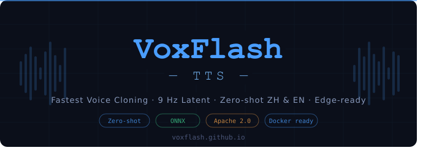

# VoxFlash-TTS ⚡

<p align="center">
  <strong>业界最快的实时语音克隆系统</strong><br>
  零样本 · 中英双语 · 边缘部署 · 消费级 GPU
</p>

<p align="center">
  <a href="https://voxflash.github.io/"></a>
  <a href="https://huggingface.co/VoxFlashTTS/VoxFlashTTS"></a>
  <a href="https://github.com/VoxFlash/VoxFlashTTS/stargazers"></a>
  <a href="LICENSE"></a>
  <a href="https://developer.nvidia.com/cuda-toolkit"></a>
  
</p>

<p align="center">
  <a href="https://voxflash.github.io/">🌐 在线演示</a> ·
  <a href="#快速开始">🚀 快速开始</a> ·
  <a href="#系统架构">🏗 系统架构</a> ·
  <a href="#性能评测">📊 性能评测</a> ·
  <a href="https://huggingface.co/VoxFlashTTS/VoxFlashTTS">🤗 模型卡片</a>
</p>

---



<p align="center">
  <a href="README.md">English</a> · <strong>中文</strong>
</p>

---

## 什么是 VoxFlash-TTS？

VoxFlash-TTS 是**业界最快的语音克隆系统**，基于极致压缩的隐空间扩散架构构建。它支持中英文零样本语音克隆，可在消费级 GPU 上运行，并从底层设计面向边缘部署场景。

核心洞察：大多数 TTS 推理瓶颈本质上是**序列长度问题**。通过将 24kHz 音频压缩至 9 Hz 隐表示——压缩率约为 EnCodec 的 8 倍——VoxFlash 在不显著牺牲音质的前提下，将端到端计算量降低了数个数量级。

> 生成 10 秒音频仅需处理 **90 个隐向量**，而传统系统通常需要 750 个以上。

---

## 核心亮点

- ⚡ **毫秒级推理** —— 消费级 GPU 上的极速生成
- 🎙️ **零样本语音克隆** —— 无需微调，即开即用
- 🌏 **中英双语支持** —— 同语言及跨语言克隆均可实现
- 💻 **边缘友好** —— 低显存占用，兼容入门级 GPU
- 🐳 **一键 Docker 部署** —— 分钟级完成部署
- 📦 **~600 MB ONNX** —— 全流程单文件可部署

---

## 系统架构

VoxFlash-TTS 基于超压缩隐空间扩散流程构建：

```
文本输入
    │
    ▼
┌─────────────────────┐
│   音素编码器         │  ConvNeXtV2 —— 轻量、硬件友好
└─────────────────────┘
    │
    ▼
┌─────────────────────┐
│   粗对齐模块         │  显式对齐 —— 复杂度低于交叉注意力
└─────────────────────┘
    │
    ▼
┌─────────────────────┐
│   扩散模型           │  隐空间多步去噪（NFE=16）
└─────────────────────┘
    │                     ▲
    │              ┌──────┴──────┐
    │              │ 说话人编码器 │  参考音频 → 说话人嵌入
    │              └─────────────┘
    ▼
┌─────────────────────┐
│   VAE 解码器         │  9 Hz 隐表示 → 24kHz 高保真波形
└─────────────────────┘
    │
    ▼
音频输出
```

### 为什么选择 9 Hz？

| 系统 | 隐帧率 | 10秒音频的隐向量数 |
|---|---|---|
| EnCodec | ~75 fps | ~750 |
| Speech LM（语义 token） | ~50 fps | ~500 |
| Stable Audio | ~21.5 fps | ~215 |
| **VoxFlash-TTS** | **9 fps** | **90** |

Transformer 自注意力的计算复杂度随序列长度呈 O(n²) 增长。序列缩短 8 倍，注意力计算量约降低 64 倍。这正是 VoxFlash 能实现毫秒级推理的根本原因。

---

## 快速开始

### 环境要求

- 搭载 CUDA ≥ 12.3.2 的 NVIDIA GPU
- Docker

### 安装

```bash
# 拉取镜像
docker pull berlinisaiah/ttsv2:v1
```

### 运行

```bash
# 后台模式（生产环境）
docker container run -d --gpus all \
  --mount type=bind,source=$(pwd)/resources,target=/app/resources \
  -p 8000:8000 berlinisaiah/ttsv2:v1

# 前台模式（调试）
docker container run -it --gpus all \
  --mount type=bind,source=$(pwd)/resources,target=/app/resources \
  -p 8000:8000 berlinisaiah/ttsv2:v1
```

### 访问 WebUI

打开浏览器，访问：

```
http://127.0.0.1:8000/demo.html
```

---

## 功能特性

### 支持语言

| 语言 | 同语言克隆 | 跨语言克隆 |
|---|---|---|
| 中文（普通话） | ✅ | ✅ |
| 英文 | ✅ | ✅ |

### 零样本克隆

无需任何微调。只需提供一段参考音频，VoxFlash 即可提取说话人嵌入，将其注入扩散过程，并输出匹配目标音色的语音。

系统支持跨语言克隆（例如中文参考音频 → 英文输出），展示了对音色与语言身份的有效解耦能力。

---

## 性能评测

音频样本来自 [Seed-TTS](https://arxiv.org/abs/2406.02430) 评测集，可与主流系统直接对比。

| 系统 | 推理速度 | 部署方式 | 零样本 | 跨语言 |
|---|---|---|---|---|
| Seed-TTS | 慢 | 云端 GPU | ✅ | ✅ |
| CosyVoice 2 | 中等 | 中等 | ✅ | ✅ |
| FastSpeech 系列 | 快 | 轻量 | ❌ | ❌ |
| **VoxFlash-TTS** | **最快** | **边缘 / 消费级 GPU** | **✅** | **✅** |

👉 在 [voxflash.github.io](https://voxflash.github.io/) 试听音频样本

---

## 应用场景

| 场景 | 核心需求 | VoxFlash 优势 |
|---|---|---|
| 实时语音交互 | 低首包延迟 | 短隐序列，扩散步数少 |
| 大规模批量合成 | 吞吐量与 GPU 成本 | 计算量数量级级别的降低 |
| 边缘 / 设备端部署 | 低显存与低功耗 | 轻量架构，兼容消费级 GPU |
| 个人开发者 | 简单易用 | 一条 Docker 命令，无需调参 |

---

## 模型大小

| 文件 | 大小 | 内容 |
|---|---|---|
| `main_model.onnx` | 697 MB | 音素编码器 + 扩散模型 + 说话人编码器 |
| `vae_decode.onnx` | 51.5 MB | VAE 解码器 |
| `vae_encode.onnx` | 46.1 MB | VAE 编码器 |
| `vocoder.onnx` | 59.7 MB | 声码器 |
| **合计** | **~854 MB** | 完整流程 |

---

## 局限性

- 极端压缩下的音频质量可能不及 Seed-TTS 等质量优先的系统
- 目前主要针对中英文优化，其他语言尚未系统评估
- 跨语言克隆的口音自然度仍有提升空间
- 参考音频短于 3 秒可能降低说话人相似度

---

## 引用

如果 VoxFlash-TTS 对您的研究或工程工作有所帮助，请引用：

```bibtex
@misc{voxflash2026,
  title     = {VoxFlash-TTS: Ultra-Compressed Latent Diffusion for Real-Time Voice Cloning},
  author    = {VoxFlash},
  year      = {2026},
  url       = {https://github.com/VoxFlash/VoxFlashTTS},
  note      = {GitHub repository}
}
```

---

## 贡献

欢迎提交 Issue、功能请求或 PR。请先开 Issue 描述您希望做出的改动。

---

## 许可证

本项目基于 [Apache 2.0 协议](LICENSE) 开源。

---

## 联系方式

- 📧 邮箱：[zhangtaiyan072@gmail.com](mailto:zhangtaiyan072@gmail.com)
- 🌐 演示：[voxflash.github.io](https://voxflash.github.io/)
- 🤗 Hugging Face：[huggingface.co/VoxFlashTTS/VoxFlashTTS](https://huggingface.co/VoxFlashTTS/VoxFlashTTS)

---

## 微信交流群

扫描下方二维码加入 **VoxFlash-TTS 语音克隆群**，与更多开发者交流探讨：

<p align="center">
  
</p>

<p align="center">
  <em>该二维码7天内有效，过期请重新获取。</em>
</p>

---

<p align="center">
  <em>不追求最富表现力的 TTS —— 而是最快、最轻、最易部署的语音克隆系统。</em>
</p>
